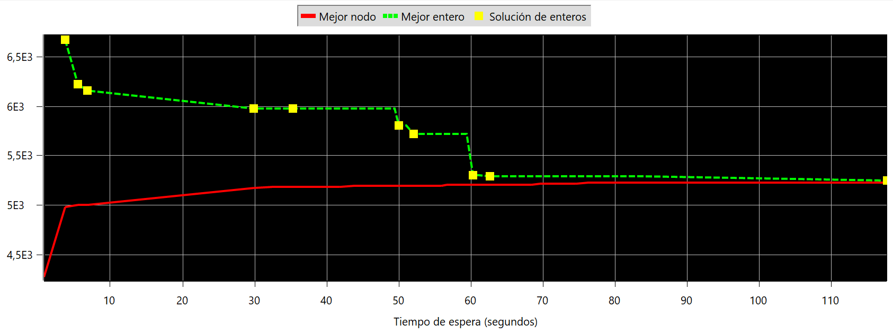
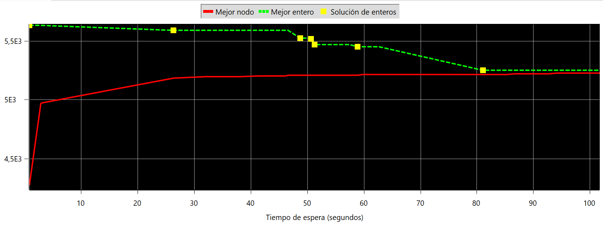

# Trabajo Práctico 3 Modelos y Optimización

### Eliminación de subtours

Para el MTZ al igual que vimos en las clases teóricas se usan un `u[i]` y un `u[j]` como variables auxiliares que representan el orden en el que se visitan los nodos del problema. La restricción que se agrega en este modelo garantiza que si se toma un camino entre el nodo `i` y  el `j` el orden de `j` debe ser al menos 1 más que el orden de `i` sin incluir el nodo inicial. En clase representamos esta misma restricción como `Uvi - Uvj + p * Yvij <= p - 1` para todo `i, j = 1,...,n` con `i` distinto de `j`. Donde `v` representa la vuelta y `p` la cantidad de nodos que se visitan en cada vuelta (para este problema en particular es una sola vuelta). Tiempo total de corrida: 1 minutos, 59 segundos y 46 centésimas. Mejor solución: 5249.622889689.

Para el otro modelo se usa un conjunto de subtours conocidos, cada uno representado por un tamaño y una secuencia de ciudades. Se agrega entonces una restricción que garantiza que, para cada subtour conocido, no más de `s.size - 1` aristas pueden estar en la solución. De esta forma se eliminan todos los subtours. Tiempo total de corrida: 22 segundos y 95 centésimas. Mejor solución: 5249.622889689.

¿Por qué el modelo MTZ tiene todos los `Xij` mientras que el otro solo los tiene cuando `i < j`?

Esto se debe a que el problema se puede representar como un grafo no dirigido en el que la distancia del nodo `i` al `j` es igual a la distancia del nodo `j` al `i`.

¿Cuándo no es posible?

Esto no sería posible si el problema se presentara como un grafo dirigido en el que la arista para ir del nodo `i` al `j` tuviera un peso diferente a la arista para ir del nodo `j` al `i`.

¿Qué beneficios tiene?

El único beneficio que se me ocurre es el de achicar notablemente el problema porque se tiene la mitad de restricciones para medir distancias entre nodos. En este sentido, el problema que NO es el MTZ es más óptimo.

### Inserción de una solución inicial

Para ambos modelos se mantuvo la misma solución final. La diferencia principal fue para el modelo MTZ en el tiempo de corrida, aumentando casi 1 minuto (un aumento del 50%), esto se debe a que el MTZ usa la solución inicial como punto de partida para la búsqueda de la solución óptima y teniendo un número de restricciones mucho mayor para la eliminación de subtours aumenta el espacio de soluciones de forma considerable. Si la inserción de la solución inicial lleva al explorador a un camino que no es el óptimo, el tiempo de corrida aumenta considerablemente.

Para el otro modelo el tiempo de corrida se mantuvo casi igual, esto se debe a que la solución inicial se utiliza de una manera ligeramente diferente. En lugar de usarla como punto de partida para la búsqueda de la solución óptima, se utiliza para generar las restricciones de eliminación de subtours. Estas restricciones son más específicas y pueden hacer que el espacio de soluciones sea de un tamaño menor y por sonsiguiente más fácil de explorar, lo que puede resultar en tiempos de ejecución más cortos.
